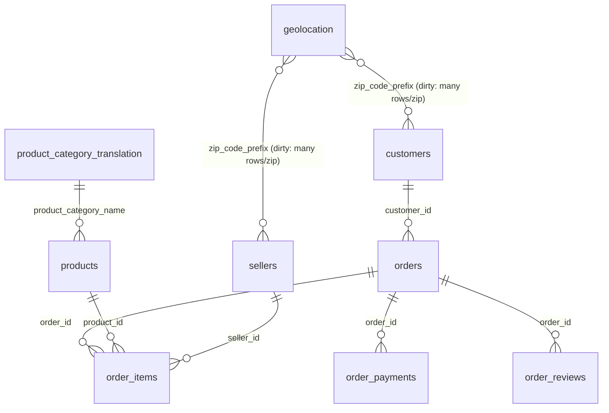

# Schema Spec — Olist Operational Source (as built)

> **Source of truth for the demo source.** Nine Olist tables plus a `status_code` lookup, built in **Azure SQL Database (General Purpose Serverless)** — `datacopilotdemo` on `sql-datacopilotdemo-lw`, schema `dbo`. Loaded ~1.55M rows with the authentic mess preserved, then the three deliberate injections applied. This is a *deliberately un-modeled* operational source (OLTP-shaped, ungoverned): a typical ODBC/SQL source, not shaped for Power BI.
>
> **Status:** built and verified as of Aug 11, 2026. All three injections applied. Where earlier drafts said "the lake," read the `datacopilotdemo` database.

---

## How the source was built (design rules that were honored)

- **Types preserve the mess deliberately.** zip prefixes are `varchar(5)` (an `int` would eat leading zeros); all text is `nvarchar` (Portuguese accents survive); lat/lng are `decimal` not `float` (duplicate coordinates per zip compare exactly). Nothing was coerced, trimmed, deduped, or standardized on load.
- **`preserve` = loaded unchanged.** Misspelled columns, leading-zero text zips, text-format dates, and the BOM all kept as-is.
- **`inject` = deliberate defect.** Three, all applied — see the injections section. These are the only deviations from source.
- Table names are cleaned (`orders`, not `olist_orders_dataset`); **column names are verbatim from source**, misspellings included.
- Indexes are on the join keys, built **after** load — so a folded query is fast and an unfolded one is visibly slow. That contrast is part of the demo.

---

## Conventions

**Keys:** `PK` · `FK → entity.column` · `NK` (natural key kept) · `CPK` (composite PK part)
**Types:** `int` · `decimal(p,s)` · `string` · `date` · `datetime(sec)` — grain stated where it matters.
**Cardinality (Mermaid):** `||--o{` one-to-many · `}o--o{` many-to-many · `||--||` one-to-one.
**Action:** `preserve` · `retype` · `rename` · `derive` · `inject` · `split`

---

## Diagram

---

## Entities

### orders
**Grain:** one row per placed order. **Role:** fact-shaped header. **Source:** olist_orders_dataset.

| target column | type | key | null | source column | action | detail |
|---|---|---|---|---|---|---|
| order_id | string | PK | no | order_id | preserve | 32-char hash; high cardinality kept |
| customer_id | string | FK → customers.customer_id | no | customer_id | preserve | |
| order_status | int | — | no | order_status | inject | text → int 1–8 (alpha); `status_code` lookup in DB, **not imported** (see injections) |
| order_purchase_timestamp | string | — | no | order_purchase_timestamp | preserve | text, `M/D/YYYY H:MM` (dates-as-text kept) |
| order_approved_at | string | — | yes | order_approved_at | preserve | text datetime |
| order_delivered_carrier_date | string | — | yes | order_delivered_carrier_date | preserve | text datetime |
| order_delivered_customer_date | string | — | yes | order_delivered_customer_date | inject | `9999-12-31` sentinel on a subset, NULL on the rest (see injections); primary SLA metric source |
| order_estimated_delivery_date | string | — | no | order_estimated_delivery_date | preserve | text date at midnight |

### order_items
**Grain:** one row per line item within an order. **Role:** detail. **Source:** olist_order_items_dataset.

| target column | type | key | null | source column | action | detail |
|---|---|---|---|---|---|---|
| order_id | string | CPK, FK → orders.order_id | no | order_id | preserve | |
| order_item_id | int | CPK | no | order_item_id | preserve | line sequence within the order |
| product_id | string | FK → products.product_id | no | product_id | preserve | |
| seller_id | string | FK → sellers.seller_id | no | seller_id | preserve | |
| shipping_limit_date | string | — | no | shipping_limit_date | preserve | text datetime |
| price | decimal(10,2) | — | no | price | preserve | |
| freight_value | decimal(10,2) | — | no | freight_value | preserve | item grain — freight is per item, not per order |

### order_payments
**Grain:** one row per payment on an order. **Role:** detail. **Source:** olist_order_payments_dataset.

| target column | type | key | null | source column | action | detail |
|---|---|---|---|---|---|---|
| order_id | string | CPK, FK → orders.order_id | no | order_id | preserve | |
| payment_sequential | int | CPK | no | payment_sequential | preserve | |
| payment_type | string | — | no | payment_type | preserve | |
| payment_installments | int | — | no | payment_installments | preserve | |
| payment_value | decimal(10,2) | — | no | payment_value | preserve | |

### order_reviews
**Grain:** ~one row per order (review_id can repeat; **no PK**). **Role:** child. **Source:** olist_order_reviews_dataset.

| target column | type | key | null | source column | action | detail |
|---|---|---|---|---|---|---|
| review_id | string | — | no | review_id | preserve | **no PK** — review_id repeats in source; duplicates are the point |
| order_id | string | FK → orders.order_id | no | order_id | preserve | |
| review_score | int | — | no | review_score | preserve | 1–5 |
| review_comment_title | string | — | yes | review_comment_title | preserve | mostly empty; Portuguese free text |
| review_comment_message | string | — | yes | review_comment_message | preserve | mostly empty; overloaded free-text field |
| review_creation_date | string | — | no | review_creation_date | preserve | text date |
| review_answer_timestamp | string | — | no | review_answer_timestamp | preserve | text datetime |

### customers
**Grain:** one row per **order-customer** (not per person). **Role:** dimension. **Source:** olist_customers_dataset.

| target column | type | key | null | source column | action | detail |
|---|---|---|---|---|---|---|
| customer_id | string | PK | no | customer_id | preserve | **per-order key**, not per-person |
| customer_unique_id | string | NK | no | customer_unique_id | preserve | actual person identifier — the grain trap |
| customer_zip_code_prefix | string | FK → geolocation.geolocation_zip_code_prefix | no | customer_zip_code_prefix | preserve | text, leading zeros kept |
| customer_city | string | — | no | customer_city | preserve | free-typed; casing/spelling variants |
| customer_state | string | — | no | customer_state | preserve | |

### sellers
**Grain:** one per seller. **Role:** dimension. **Source:** olist_sellers_dataset.

| target column | type | key | null | source column | action | detail |
|---|---|---|---|---|---|---|
| seller_id | string | PK | no | seller_id | preserve | |
| seller_zip_code_prefix | string | FK → geolocation.geolocation_zip_code_prefix | no | seller_zip_code_prefix | preserve | text, leading zeros kept |
| seller_city | string | — | no | seller_city | preserve | free-typed variants |
| seller_state | string | — | no | seller_state | preserve | |

### products
**Grain:** one per product. **Role:** dimension. **Source:** olist_products_dataset.

| target column | type | key | null | source column | action | detail |
|---|---|---|---|---|---|---|
| product_id | string | PK | no | product_id | preserve | |
| product_category_name | string | FK → product_category_translation.product_category_name | yes | product_category_name | preserve | Portuguese; some blank |
| product_name_lenght | int | — | yes | product_name_lenght | preserve | **misspelled in source — keep** |
| product_description_lenght | int | — | yes | product_description_lenght | preserve | **misspelled in source — keep** |
| product_photos_qty | int | — | yes | product_photos_qty | preserve | |
| product_weight_g | int | — | yes | product_weight_g | preserve | |
| product_length_cm | int | — | yes | product_length_cm | preserve | |
| product_height_cm | int | — | yes | product_height_cm | preserve | |
| product_width_cm | int | — | yes | product_width_cm | preserve | |

### product_category_translation
**Grain:** one per category. **Role:** reference / snowflake hop. **Source:** product_category_name_translation.

| target column | type | key | null | source column | action | detail |
|---|---|---|---|---|---|---|
| product_category_name | string | PK | no | product_category_name | preserve | **BOM on this column in source — keep** |
| product_category_name_english | string | — | no | product_category_name_english | preserve | left un-joined on purpose |

### geolocation
**Grain:** one row per lat/lng point per zip prefix — **many rows per zip.** **Role:** reference (dirty). **Source:** olist_geolocation_dataset.

| target column | type | key | null | source column | action | detail |
|---|---|---|---|---|---|---|
| geolocation_zip_code_prefix | string | — | no | geolocation_zip_code_prefix | preserve | **not unique**; text, leading zeros |
| geolocation_lat | decimal(12,8) | — | no | geolocation_lat | preserve | duplicate coords per zip |
| geolocation_lng | decimal(12,8) | — | no | geolocation_lng | preserve | |
| geolocation_city | string | — | no | geolocation_city | preserve | spelling/casing variants live here |
| geolocation_state | string | — | no | geolocation_state | preserve | |

No primary key by design. Relating customers/sellers here on zip is an accidental many-to-many — keep it that way; it's the dirty-dimension trap.

### status_code
**Grain:** one row per order status. **Role:** reference / lookup. **Source:** hand-created in `dbo`. **Lives in the `datacopilotdemo` database; deliberately NOT imported into the model.**

| target column | type | key | null | source column | action | detail |
|---|---|---|---|---|---|---|
| code | int | PK | no | — | preserve | matches `orders.order_status` type so the relationship *can* form once discovered |
| label | string (nvarchar) | — | no | — | preserve | plain-text status name (`approved`, `canceled`, …); English |

Resolves `orders.order_status`, but is not referenced by the model — no relationship, not imported into Power Query, **no FK constraint** (discovery must be genuine). Present and joinable in the same database the model connects to, so a Copilot with source visibility *could* discover it; absent from the model so one with only PBIP context can't. This is the discoverability beat — see injections.

---

## Deliberate injections (all applied)

The only deviations from source. All three done in the database; verified.

1. **Status codes + unreferenced lookup (discoverability beat).** ✅ applied
   - `orders.order_status` encoded text → `int`, **alphabetical** mapping: `approved=1, canceled=2, created=3, delivered=4, invoiced=5, processing=6, shipped=7, unavailable=8`. Arbitrary on purpose — not stage-ordered, so no partial codebook leaks.
   - The `status_code` lookup (see Entities) resolves these codes but is **excluded from the model**: no relationship, not imported into Power Query, no FK. It exists in the database because someone made it; it just wasn't in the model requirements, so it never got pulled in.
   - Demo question: does any Copilot notice the unreferenced table and suggest wiring in the key. Types match (both `int`) so the relationship can form once discovered.
   - *(Encoding the fact is the only place clean source data was deliberately changed — logged. The lookup table itself is plain source.)*
2. **Sentinel date (single).** ✅ applied — `orders.order_delivered_customer_date`: all **619 canceled orders (status code 2)** stamped `12/31/9999 0:00`; the other 2,346 undelivered orders left genuinely NULL. Origin story: an upstream rule stamped canceled orders with a far-future "never" date. The column now carries both conventions (sentinel + NULL) at once. Invisible in code, wrong only in behavior — a naive delivery-days average across all rows detonates; filtering to delivered orders never sees it. Note: dates are text, so the sentinel sits as a string among the US-format text dates — the metric has two stacked causes (text→date conversion + sentinel). *(8 delivered orders with a null delivery date are authentic Olist wrinkle — left untouched.)*
3. **Audit columns.** ✅ applied — `created_at`, `updated_at`, `created_by` (all `nvarchar`, `M/D/YYYY H:MM` text-date style) added to `orders`, `order_items`, `products`, `customers`, `sellers`, referenced by nothing. Cardinality contrast is the lesson: `created_at` is high-cardinality (~31k–91k distinct per table — near one per row), `created_by` is low (3–4 service-account/name values). Both unused; only the timestamps are the compression cost. Removable bloat — contrast with the hash keys, equally high-cardinality but undroppable.

---

## Already dirty in source — preserve, do not "fix"

These arrive free from this export. Cleaning any of them removes a teaching moment.

- **Text dates** in `M/D/YYYY H:MM` (US) format on every timestamp column.
- **Leading-zero zip prefixes** stored as text (`customers`, `sellers`, `geolocation`).
- **Misspelled columns** `product_name_lenght`, `product_description_lenght`.
- **BOM** prefixing `product_category_name` in the translation file.
- **Geolocation**: many rows per zip, duplicate coordinates, no key → many-to-many trap.
- **`customer_id` vs `customer_unique_id`** grain trap (per-order vs per-person).
- **Portuguese category names** + separate translation left un-joined (snowflake hop).
- **Sparse/empty** review comment title & message; free-typed **city** spelling and casing variants.

---

## Change log
- `2026-08-02` — initial spec generated from uploaded CSV samples (headers + sample rows). Confirm against full files before build if column sets differ.
- `2026-08-02` — finalized injections to three: (1) status codes with lookup resident in lake but excluded from model; (2) single `9999-12-31` sentinel; (3) audit columns on five tables. Dropped inconsistent delete/active flags — less representative of a gold-layer source. ETL-logic-as-hidden-knowledge parked as a "if we need messier" lever.
- `2026-08-02` — added `status_code` as an original source entity (hand-created, lives in lake, unwired from model). Injection 1 is now just the fact-side encoding + not importing the lookup.
- `2026-08-11` — **built.** Source stood up in Azure SQL (Serverless), `datacopilotdemo.dbo`, ~1.55M rows, counts matching source. All three injections applied and verified (status encoding + `status_code` table no-FK; 619 canceled orders stamped `12/31/9999`; audit columns on 5 tables with cardinality contrast confirmed). Reconciled to as-built: "lake" → the SQL database; `order_reviews` has no PK (review_id repeats). Row counts — geolocation 1,000,163 · order_items 112,650 · order_payments 103,886 · customers 99,441 · orders 99,441 · order_reviews 99,224 · products 32,951 · sellers 3,095 · category_translation 71 · status_code 8.
